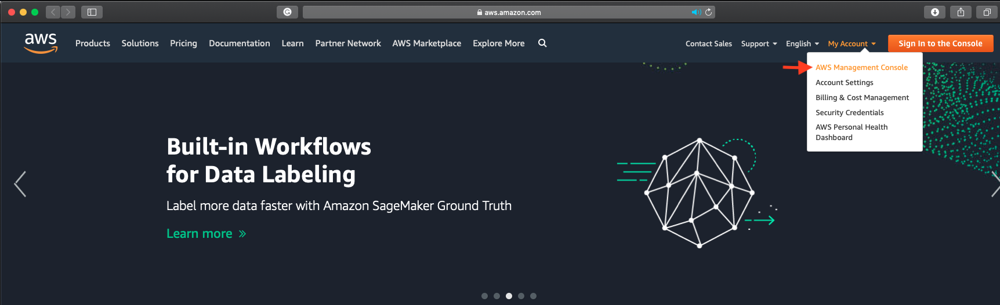
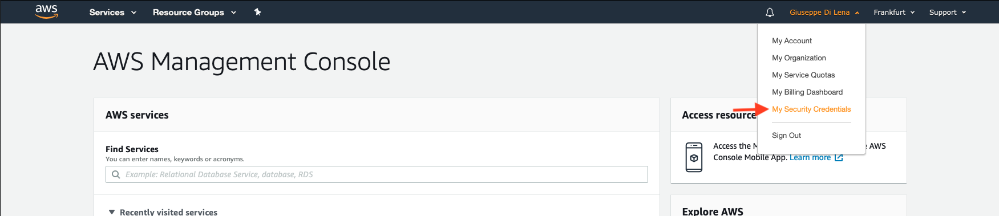
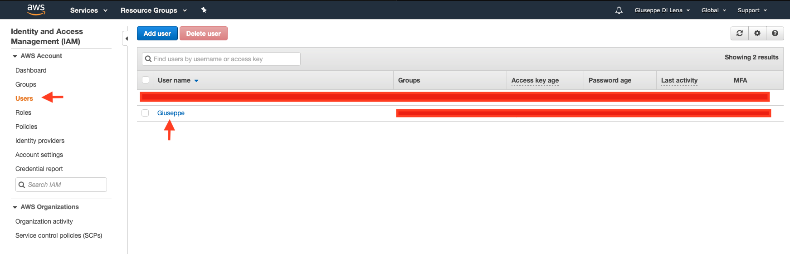
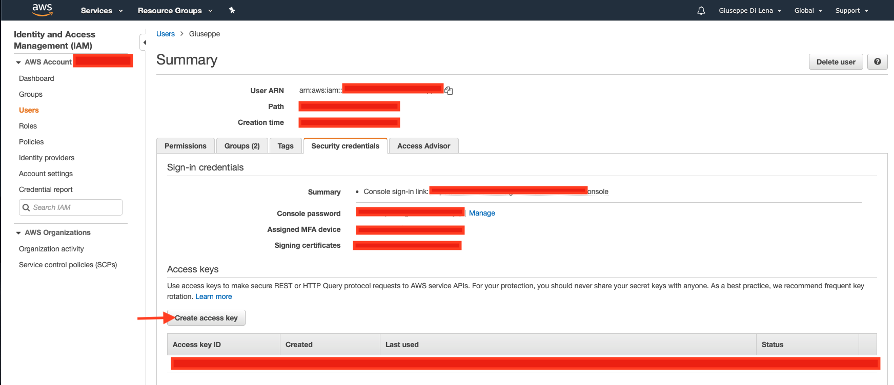
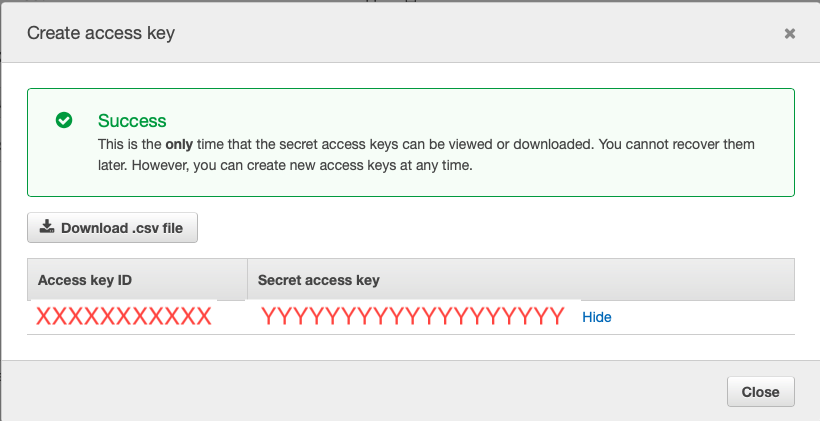
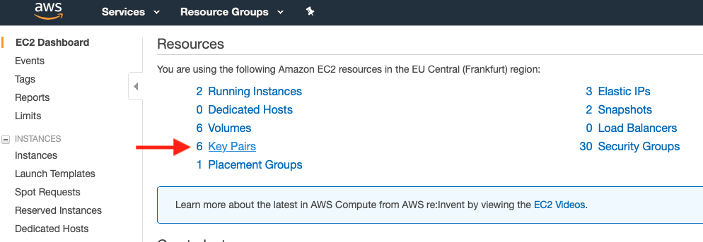
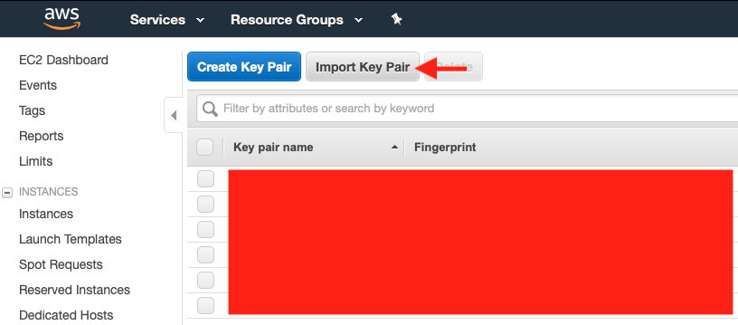
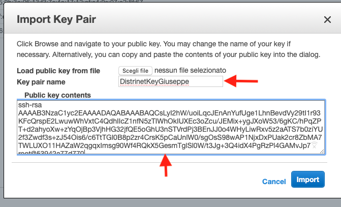
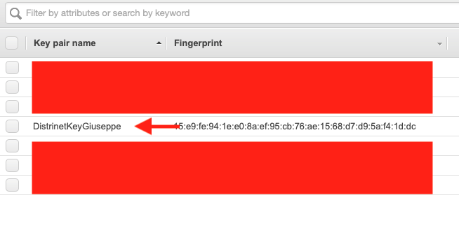

# Distrinet

Distrinet is a Distributed SDN Network Emulation Tool able to run in Cloud (Amazon AWS Platform in this version) or Physical Clusters ( Beta Version ).

Distrinet is based on [Mininet](http://mininet.org) (https://github.com/mininet/mininet)


## Getting Started

These instructions will get you a copy of the project up and running on your local machine for development and testing purposes. See deployment for notes on how to deploy the project on a live system.

### Prerequisites
Distrinet is compatible with python 3.6 or latest versions.

You need:
* an Amazon AWS account [link](https://aws.amazon.com/)

* git
```
sudo apt install git
```

* pip
```
sudo apt install python3-pip
```
* boto3 
```
pip3 install boto3
```

* aws cli 
```
pip3 install --upgrade awscli
```

* paramiko 
```
pip install --upgrade paramiko
```

* You need to put your AWS Credentials in ~/.aws/credentials.
You can create your aws_access_key_id and aws_secret_access_key from the [AWS Web interface](https://aws.amazon.com/)
```
mkdir ~/.aws
vim ~/.aws/credentials
```

File ~/.aws/credentials:
```
[default]
aws_access_key_id=XXXXXXXXXXXXXXXXX
aws_secret_access_key=YYYYYYYYYYYYYYYYYYYYYY
```

How to create aws_access_key_id and aws_secret_access_key via [AWS Web interface](https://aws.amazon.com/):

* Go to https://aws.amazon.com/ and log in


* Click on your username and go to "My security Credentials"


* On the left pannel click on "Users" and then click on your User(be sure that it has the right permissions)


* On Summary pannel Click on "Create access Key"


* Congratulation, you have a new Access Key ID and a Secret access key 


* you need to import you ssh public key in AWS

if you dont have a private and public key created in your system you can generate it with:
```
ssh-keygen
```

for this version you need to leave the default values like here:
```bat
root@53942a77d770:# ssh-keygen
Generating public/private rsa key pair.
Enter file in which to save the key (/root/.ssh/id_rsa):
Created directory '/root/.ssh'.
Enter passphrase (empty for no passphrase):
Enter same passphrase again:
Your identification has been saved in /root/.ssh/id_rsa.
Your public key has been saved in /root/.ssh/id_rsa.pub.
The key fingerprint is:
SHA256:zmU65OeCHb/zjBJQOTmSUW9vonTTsOdv9Sv6+VCUtoI root@53942a77d770
The key's randomart image is:
+---[RSA 2048]----+
|      .+.o       |
|      o *.      .|
|       o o+    + |
|      .  . =. o .|
|       .S BE=. o |
|       *o* *  o .|
|       oB+. .. ..|
|      . ++oo o+ .|
|         o+==++o.|
+----[SHA256]-----+
```

* cat your id_rsa.pub (make sure that the extension is .pub)
```
root@53942a77d770:/home/Distrinet# cat ~/.ssh/id_rsa.pub
ssh-rsa AAAAB3NzaC1yc2EAAAADAQABAAABAQCsLyI2hW/uoiLqcJEnAnYufUge1LhnBevdVy29tI1r93KFcQrspE2LwuwWhVxtC4QdhIIcZ1nfN5zTIWhOkIUXEc3oZcu/JEMix+ygJXoW53/6gKC/hPqZPT+d2ahyoXw+zYqOjBp3VjhHG32jfQE5oGhU3nSTVrdPj3BEnJJ0o4WHyLiwRxv5z2aATS7b0ziYU2f3Zwdf3s+zJ54Ois6/c6TtTGI0B8p2zr4CrsK5pCaUnlW0/sgOsS98wAP1NjxDxPUak2cr8ZbMA7TWLUXO11HAZaW2qgqxImsg90Wf4RQkX5GesmTglSl0W/t3Jg+3Q4idX4PgRzPl4GAMvJp7 root@53942a77d770
```

#### import  your id_rsa.pub in AWS:
* Go to https://aws.amazon.com/ and log in like before;


* Go on "Services" --> "EC2"


* Click on "Key pairs"


* "Import Key pair"


* Choose the name that you want, in my case I choosed "DistrinetKeyGiuseppe"(you need to use this name after) and paste your id_rsa.pub in Public key contents and Import it.


* You can seen now that your key has been added



### Installation
If you are using Windows you can deploy Distrinet with Option 2.

#### Option 1: install Distrinet Client on your machine (Linux and Mac OSX Supported)

* Clone the repository

```
git clone https://github.com/Giuseppe1992/Distrinet.git
git clone https://github.com/mininet/mininet.git
```


* install requirements

```
cd Distrinet
pip3 install -r requirements.txt
```

* Update you PYTHONPATH with Mininet and Distrinet cloud. (export PYTHONPATH=$PYTHONPATH:mininet_path:distrinet_path)

```
check the repository path.

root@53942a77d770:~# ls
Distrinet  mininet
root@53942a77d770:~# pwd
/root
```
* in this case we have both the repositories in /root. We should add /root/mininet and /root/Distrinet/v2/mininet/distrinet/cloud/
to the PYTHONPATH

```
export PYTHONPATH=$PYTHONPATH:/root/mininet:/root/Distrinet/v2/mininet/distrinet/cloud/
```

You are ready to run your first experiment.

#### Option 2: Docker image
TO BE DONE

### Example

Here we explain how to run a simple experiment.

#### Case 1: you have not deployed Distrinet before
In this case Distrinet will deploy the virtual instances for you automatically. There an example file on Distrinet/v2/mininet/iperf_test.py
* Go to Distrinet/v2/mininet/
```
cd  /root/Distrinet/v2/mininet/
```

* you need to edit some lines; you can use the editor that you prefer. in this case I am using vim.
```
vim iperf_test.py
```

* at line 98 you have to modify the parameter 'keyname': 'pub_dsaucez' with the name that you assigned to your public key in AWS, in my case I have to modify in: 'keyname': 'DistrinetKeyGiuseppe' 
* at line 99  and line 102 you have to modify the parameter 'ImageId': 'ami-xxxxx' you need to find the correct ami-ID in your region.


## Deployment

Add additional notes about how to deploy this on a live system

## Built With

* [LXD](http://www.dropwizard.io/1.0.2/docs/) - LXC Container management Tool
* [ANSIBLE](https://maven.apache.org/) - Infrastructure Management
* [BOTO3](https://rometools.github.io/rome/) - AWS Python api


## Authors

* **[Giuseppe Di Lena](mailto:giuseppe.di-lena@inria.fr)** 
* **[Damien Saucez](mailto:damien.saucez@inria.fr)**
* **[Andrea Tomassilli](mailto:andrea.tomassilli@gmail.com)**

## License

This project is licensed under the MIT License - see the [LICENSE.md](LICENSE.md) file for details

## Acknowledgments

* Inspiration from [Maxinet](https://maxinet.github.io) and [Containernet](https://containernet.github.io) projects